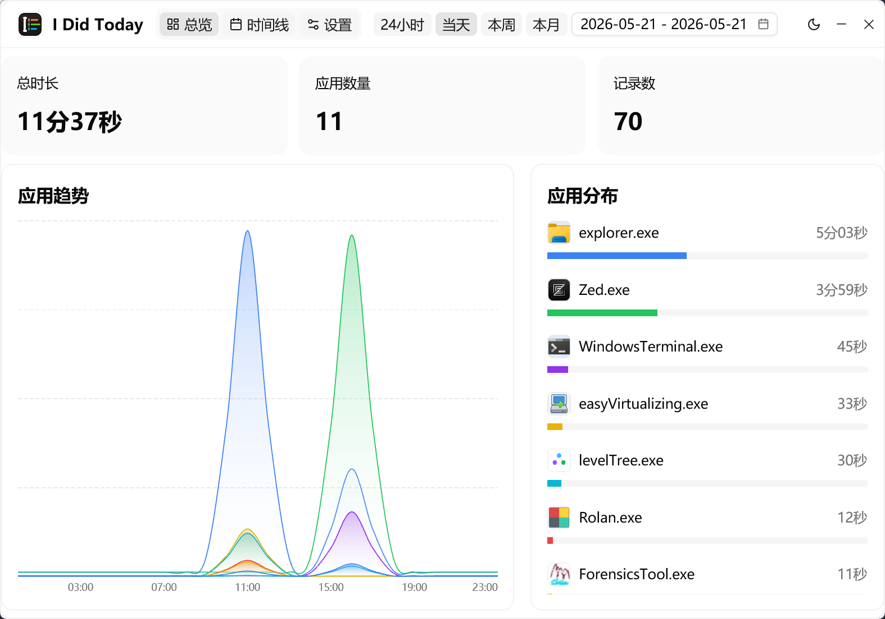
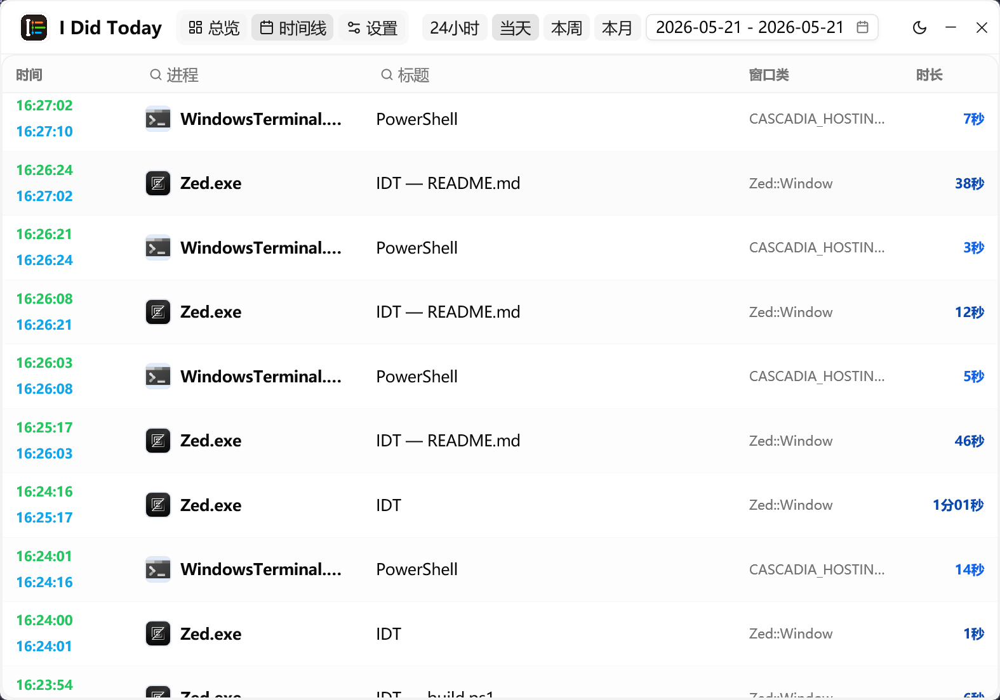

# IDT

IDT (I did today) 是一个仅限 Windows 的 Rust 桌面应用，用来自动记录每天聚焦过的窗口和应用使用时长。Vibe Coding 100%.

## 功能

- GPUI + gpui-component 图形界面
- Windows 系统托盘
- 自动采集前台进程名、窗口类名、窗口标题
- 可配置采样间隔
- SQLite 本地存储
- 今日总览、应用分布、小时图表、时间线

## 运行

```powershell
cargo run
cargo build --release
```

数据库默认保存到：

```text
%LOCALAPPDATA%\IDT\idt.sqlite3
```

## 界面




